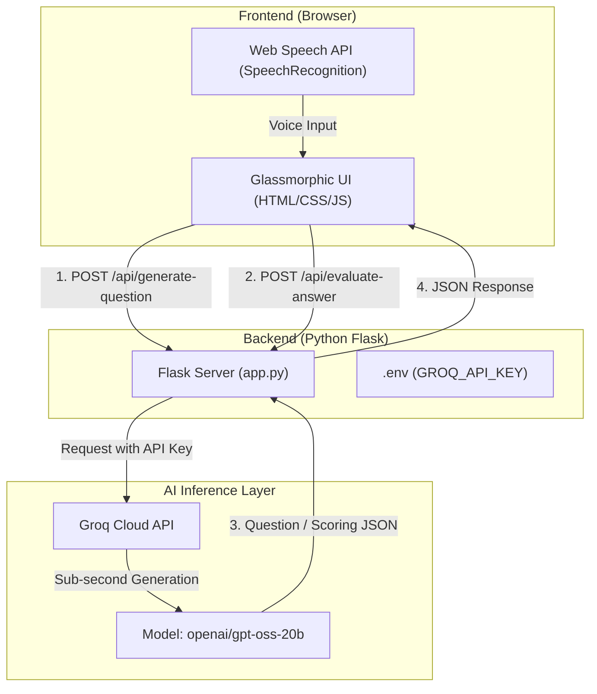

<<<<<<< HEAD
# 🎯 AI Mock Interviewer

An adaptive, full-stack AI interview platform designed to help job candidates practice real-time technical and behavioral interviews. Powered by **Python Flask**, **Groq's high-speed LLM engine**, and a modern **Glassmorphism UI** with integrated **Voice-to-Text speech recognition**.

[](https://www.python.org/)
[](https://flask.palletsprojects.com/)
[](https://groq.com/)
[](https://developer.mozilla.org/en-US/docs/Web/JavaScript)
[](https://opensource.org/licenses/MIT)

---

## ✨ Features

- 🎯 **16+ Job Roles & 5 Seniority Levels**: Practice for roles like *Software Engineer*, *Data Scientist*, *Product Manager*, *UI/UX Designer*, and more, ranging from *Fresher* to *Lead/Principal*.
- 🎙️ **Real-Time Voice & Speech Input**: Integrated native browser Web Speech API (`SpeechRecognition`) for practicing oral responses out loud with live transcript stitching.
- ⚡ **Ultra-Fast Sub-Second AI Inference**: Powered by Groq's LPU hardware for instant question generation and evaluation.
- 🔄 **Adaptive Non-Repetitive Questions**: Tracks candidate history so each new question logically builds on previous responses without repeating topics.
- 📊 **Comprehensive Analytics & Evaluation**: Returns numerical scoring (out of 10), verdict classification (*Outstanding*, *Strong Candidate*, *Needs Improvement*), and expandable per-question feedback accordions.
- 💎 **Luxury Glassmorphism UI**: Styled with dark canvas aesthetics, ambient radial glow meshes, custom SVG circular score meters, and responsive grid layouts.
- 🔒 **Secure Server-Side Architecture**: Keeps API keys strictly hidden on the Flask backend environment — zero API key exposure to client browsers.

---

## 🗂️ Project Structure

```text
AI-INTERVIEW/
├── backend/
│   ├── app.py              # Flask REST API server & Groq integration
│   ├── requirements.txt    # Backend Python dependencies
│   └── .env                # Secret environment variables (GROQ_API_KEY)
├── frontend/
│   └── index.html          # High-performance Vanilla HTML5/CSS3/JS UI
├── .gitignore              # Git ignore configuration
├── README.md               # Project documentation
└── venv/                   # Local Python Virtual Environment
```

---

## 🏗️ Architecture & Data Flow



---

## 🛠️ Tech Stack Breakdown

| Component | Technology | Description |
| :--- | :--- | :--- |
| **Backend** | Python 3, Flask, Flask-CORS | Lightweight REST API server serving endpoints and static files |
| **AI Inference** | Groq Cloud API (`openai/gpt-oss-20b`) | Ultra-fast LPU inference engine for adaptive QA & evaluation |
| **Frontend** | HTML5, Vanilla CSS3, JavaScript (ES6+) | Frameworkless glassmorphic web UI with standard CSS Custom Properties |
| **Voice Recognition**| Web Speech API | Native speech-to-text audio transcription |
| **Environment** | `python-dotenv` | Hides secrets on the server side |

---

## ⚙️ Local Setup & Installation

### 1. Clone the Repository
```bash
git clone https://github.com/YourUsername/AI-INTERVIEW.git
cd AI-INTERVIEW
```

### 2. Configure Backend Environment
Create a virtual environment and install dependencies:

```bash
# Windows
python -m venv venv
.\venv\Scripts\activate

# Install requirements
pip install -r backend/requirements.txt
```

Create a `.env` file inside `backend/`:
```env
GROQ_API_KEY="your_groq_api_key_here"
```
> 💡 Get a free Groq API key from [Console Groq](https://console.groq.com/keys).

### 3. Run the Backend Server
```bash
python backend/app.py
```
The server will start at: `http://127.0.0.1:5000`

### 4. Access the Application
Open your browser and visit:
```text
http://127.0.0.1:5000
```
*(Or open `frontend/index.html` directly in your browser).*

---

## 📡 API Reference

### 1. Generate Question
- **Endpoint**: `/api/generate-question`
- **Method**: `POST`
- **Payload**:
  ```json
  {
    "role": "Software Engineer",
    "level": "Mid-level (3-5 years)",
    "focus": "Technical",
    "total": 5,
    "current": 1,
    "prev_qas": []
  }
  ```
- **Response**:
  ```json
  {
    "question": "How would you design a distributed message queue to guarantee ordering across partitions?"
  }
  ```

### 2. Evaluate Answer
- **Endpoint**: `/api/evaluate-answer`
- **Method**: `POST`
- **Payload**:
  ```json
  {
    "role": "Software Engineer",
    "level": "Mid-level",
    "question": "How do you scale a relational database?",
    "answer": "Using index optimization, read replicas, and sharding."
  }
  ```
- **Response**:
  ```json
  {
    "score": 8,
    "feedback": "Great breakdown of database scaling techniques. Mentioning sharding and read replicas shows strong real-world understanding."
  }
  ```

---

## 🚀 Deployment

### Backend (Render / Railway)
1. Push project to GitHub.
2. Create a new **Web Service** on [Render](https://render.com/).
3. Set **Root Directory**: `backend`
4. Set **Build Command**: `pip install -r requirements.txt`
5. Set **Start Command**: `gunicorn app:app`
6. Add Environment Variable: `GROQ_API_KEY = your_key`

### Frontend (GitHub Pages / Vercel)
1. In `frontend/index.html`, set `API_BASE` to your deployed backend URL:
   ```javascript
   const API_BASE = "https://your-backend.onrender.com";
   ```
2. Deploy the `frontend/` directory to GitHub Pages or Vercel.

---

## 📄 License

This project is licensed under the [MIT License](LICENSE) — free to use, modify, and distribute.
=======
# AI-INTERVIEW
>>>>>>> 3c3803888cec0c09f97f7e7b3bd25fd9514cd686
